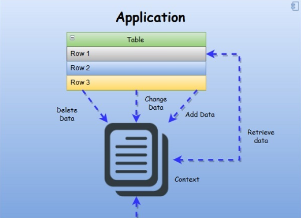
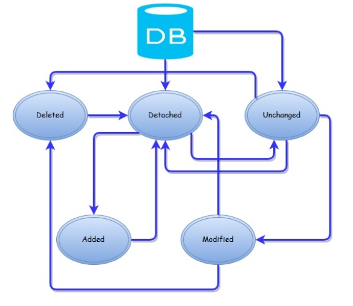

## Entity Framework notes

### Relationships

#### One-to-Many

```cs
public class Student {
   public int ID { get; set; }
   public string LastName { get; set; }
   public string FirstMidName { get; set; }
   public DateTime EnrollmentDate { get; set; }

   public virtual ICollection<Enrollment> Enrollments { get; set; }
}

public class Enrollment {

   public int EnrollmentID { get; set; }
   public int CourseID { get; set; }
   public int StudentID { get; set; }

   public Grade? Grade { get; set; }
   public virtual Course Course { get; set; }
   public virtual Student Student { get; set; }
}
```
#### Many-to-Many

```cs
public class Course {
   [DatabaseGenerated(DatabaseGeneratedOption.None)]

   public int CourseID { get; set; }
   public string Title { get; set; }

   public int Credits { get; set; }
   public virtual ICollection<Enrollment> Enrollments { get; set; }
}
```

#### One-to-One

```cs
public class Student {
   public int ID { get; set; }
   public string LastName { get; set; }
   public string FirstMidName { get; set; }
   public DateTime EnrollmentDate { get; set; }

   public virtual ICollection<Enrollment> Enrollments { get; set; }
   public virtual StudentProfile StudentProfile { get; set; }
}

public class StudentProfile {

   public StudentProfile() {}
   public int ID { get; set; }
   public string Email { get; set; }
   public string Password { get; set; }

   public virtual Student Student { get; set; }
}
```

### Entity Framework - Lifecycle

#### Lifetime

The lifetime of a context begins when the instance is created and ends when the instance is either disposed or garbage-collected.

- Context lifetime is a very crucial decision to make when we use ORMs.
- The context is performing like an entity cache, so it means it holds references to all the loaded entities which may grow very fast in memory consumption and it can also cause memory leaks.
- In the below diagram, you can see the upper level of data workflow from application to database via Context and vice versa.




#### Entity Lifecycle

The **state** is an enum of type **System.Data.EntityState** that declares the following values

- **Added**: The entity is marked as added.
- **Deleted**: The entity is marked as deleted.
- **Modified**: The entity has been modified.
- **Unchanged**: The entity hasn’t been modified.
- **Detached**: The entity isn’t tracked.

#### State Changes in the Entity Lifecycle

##### Unchanged state

- entity is Unchanged, bound to the context but it hasn’t been modified.
- By default, an entity retrieved from the database is in this state.
- When an entity is attached to the context (with the Attach method), it similarly is in the Unchanged state.
- The context can’t track changes to objects that it doesn’t reference, so when they’re attached it assumes they’re Unchanged.

##### Detached State

- Detached is the default state of a newly created entity because the context can’t track the creation of any object in your code.
- This is true even if you instantiate the entity inside a using block of the context.
- Detached is even the state of entities retrieved from the database when tracking is disabled.
- When an entity is detached, it isn’t bound to the context, so its state isn’t tracked.
- It can be disposed of, modified, used in combination with other classes, or used in any other way you might need.
- Because there is no context tracking it, it has no meaning to Entity Framework.

##### Added State

- When an entity is in the Added state, you have few options. In fact, you can only detach it from the context.
- Naturally, even if you modify some property, the state remains Added, because moving it to Modified, Unchanged, or Deleted makes no sense.
- It’s a new entity and has no correspondence with a row in the database.
- This is a fundamental prerequisite for being in one of those states (but this rule isn’t enforced by the context).



##### Modified State

- When an entity is modified, that means it was in Unchanged state and then some property was changed.
- After an entity enters the Modified state, it can move to the Detached or Deleted state, but it can’t roll back to the Unchanged state even if you manually restore the original values.
- It can’t even be changed to Added, unless you detach and add the entity to the context, because a row with this ID already exists in the database, and you would get a runtime exception when persisting it.


##### Deleted State

- An entity enters the Deleted state because it was Unchanged or Modified and then the DeleteObject method was used.
- This is the most restrictive state, because it’s pointless changing from this state to any other value but Detached.

Use **using** statement if you want all the resources that the **context** controls to be **disposed**

```cs
using (var context = new UniContext()) {

   var student = new Student {
      LastName = "Khan",
      FirstMidName = "Ali",
      EnrollmentDate = DateTime.Parse("2005-09-01")
   };

   context.Students.Add(student);
   context.SaveChanges();
}
```
